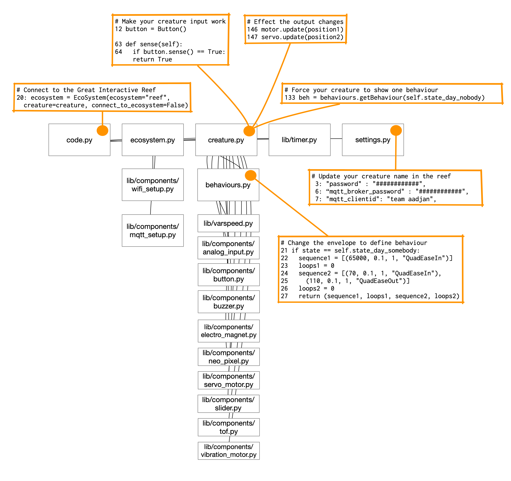

# Guide into the code

## Connect components

The components in your fanny pack should connect to a specific pin on the Bitsy Expander to make it work out of the box.

Diagram showing on what ports the software expects the components (output on the right side, input on the left side).

## Code Map

This code map shows the most relevant code files that can be found on your Itsy Bitsy Expander Board. It highlights those files and lines of code where that will have to be changed to adapt the code template to the specific creature you are designing.

[GIR creature code map.pdf](guide_into_the_code/GIR_creature_code_map.pdf)

## System Diagram

This System Diagram is drawn in the visual style that is mandatory in the Interactive Environments minor. You can find more about it in our Knowledge Gallery for if you want to create a system diagram for your creature. On the Interactive Technology day we focus on designing the technology of one creature, so the network connection is not active at first.

A depiction of the Great Interactive Reef system that will be exhibited at the end of the Interaction Studies Course. It shows one creature in detail (Creature example 2) and the network connection to the MQTT broker and the other Reef Creatures.

## What do we mean with an Envelope?

[Envelope (music)](https://en.wikipedia.org/wiki/Envelope_(music))

## Specifying Envelopes in CircuitPython

[https://github.com/pvanallen/VarSpeedPython](https://github.com/pvanallen/VarSpeedPython)

[Easing Functions Cheat Sheet](https://easings.net/)